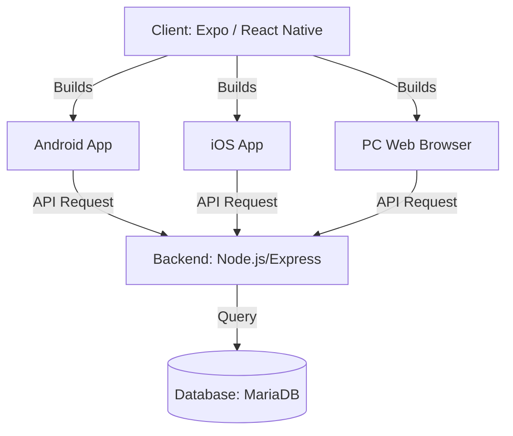

# Project Analysis & Modernization Plan (Updated)

## 1. Analysis of Existing Codebase
- **Structure**: Static HTML/CSS/JS Prototype.
- **Components**: Login, Todo List, Calendar, Dark Mode (UI Only).
- **Gap**: No Backend, No Database.

## 2. Final Architecture Recommendation: "One Codebase, Three Platforms"
The user requires **Android**, **iOS**, and **PC (Web)** access with a **Social Login/DB Sync**.

### The Solution: React Native (via Expo) + React Native Web 🏆
- **Why?**:
  - **Mobile**: Native files (.apk, .ipa) for Play Store & App Store.
  - **PC/Web**: Expo exports the *same code* as a responsive Website.
  - **Maintenance**: You only edit **one file** to update all 3 platforms.
- **Suitability**: Perfect for a "Diary/Todo" app which is highly interactive.

### System Diagram

### Advantages
1. **Consistency**: The UI looks premium and identical on Phone and PC.
2. **Efficiency**: Develop feature once -> Deploy everywhere.
3. **Data**: All platforms read/write to the same MariaDB `edito_db`.

## 3. Implementation Plan

### Step 1: Backend (Server) - *In Progress*
- [x] Setup Node.js + Express
- [x] Design DB Schema (`init_db.sql`)
- [ ] Implement API Routes (Login, Todos, Diary)

### Step 2: Client (Frontend) - *Next Step*
- Initialize **Expo** project.
- Configure for **Web Support**.
- Port `index.html` (Onboarding) to React Native Screen.
- Port `login.html` to React Native Screen.

### Step 3: Integration
- Connect Client to Server API.
- Test on Android Emulator and Web Browser simultaneously.
